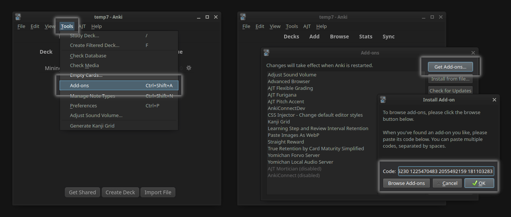
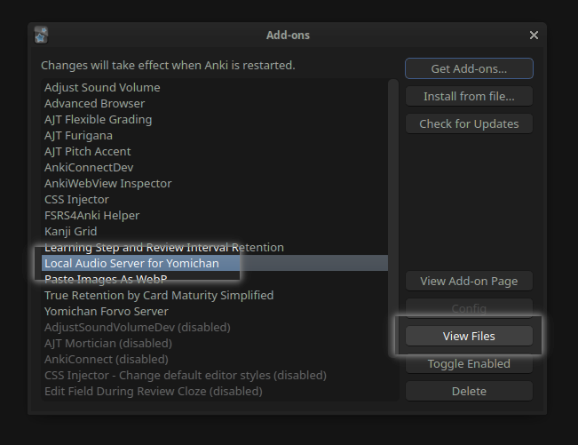

# Local Audio Server for Yomichan

This [Anki add-on](https://ankiweb.net/shared/info/1045800357)
runs a local server of which Yomichan can fetch audio files from,
using a database containing over 250,000 unique expressions.
With this setup, you are able to create Anki cards nearly instantaneously,
and get word audio without a working internet connection.

Core maintainer: [**@Aquafina-water-bottle**](https://www.github.com/Aquafina-water-bottle)

<sup>
P.S. Feel free to check out <a href="https://aquafina-water-bottle.github.io/jp-mining-note/jpresources/">my other resources</a> if you're interested!
</sup>

## Reasons for and against this setup

<details> <summary><b>Advantages:</b> <i>(click here)</i> </summary>

1. Most audio is gotten in **almost instantly**. Without the local audio server,
    fetching the audio can take anywhere from three seconds to a full minute
    (on particularly bad days).

    Most of the delay from Yomichan when creating cards is from fetching the audio.
    In other words, getting the audio is the main bottleneck of when creating Anki cards.
    This add-on removes the aforementioned bottleneck, meaning **you can make cards with virtually 0 delay**.

1. If you do not have internet access, you can still add audio to your cards.

1. Compared to standard Yomichan, this does improve coverage because it adds the Forvo and NHK 2016 source.

</details>

<details> <summary><b>Disadvantages:</b> <i>(click here)</i> </summary>

1. This setup requires about **5GB of free space**.

1. Despite having wide coverage, some words may simply not be covered by the local audio server.
    Attempting to fetch these words will fallback to online sources,
    which means that there will be no improvement in speed.

</details>


## Steps

These instructions setup the local audio server for the PC (Windows, MacOS, Linux) release of Anki.
If you wish to use this on Android, see [here](https://github.com/KamWithK/AnkiconnectAndroid).
There is currently no way of using this on AnkiMobile (iOS).

1. Download all the required audio files.
    They can be found at this [torrent link](https://nyaa.si/view/1625597).
    If you have never downloaded from a torrent before, I highly recommend using the
    [qBittorrent](https://www.qbittorrent.org/) client.

    <details> <summary>Magnet link <i>(click here)</i></summary>

        magnet:?xt=urn:btih:15f4557bc3e5464609bc1f9ac444db3611b97541&dn=Yomichan%20Japanese%20Local%20Audio%20-%20JapanesePod101%20%28JPod%29%2C%20NHK%2C%20Forvo%20Select%20Users&tr=http%3A%2F%2Fnyaa.tracker.wf%3A7777%2Fannounce&tr=udp%3A%2F%2Fopen.stealth.si%3A80%2Fannounce&tr=udp%3A%2F%2Ftracker.opentrackr.org%3A1337%2Fannounce&tr=udp%3A%2F%2Fexodus.desync.com%3A6969%2Fannounce&tr=udp%3A%2F%2Ftracker.torrent.eu.org%3A451%2Fannounce

    </details>

1. Extract the `7z` file. To do this, use [7zip](https://7-zip.org/download.html).
    If 7zip fails to extract the file, try downloading the file again (the `7z` file could be corrupted).

1. [Download the add-on](https://ankiweb.net/shared/info/1045800357):
    * Within Anki, navigate to `Tools` →  `Add-ons` →  `Get Add-ons...`
    * Copy and paste this code: `1045800357`

        

    This add-on only works for Anki versions 2.1.50 and above.
    If you are using Anki versions 2.1.49 or below, I highly recommend updating.
    If you can't do this for whatever reason, the legacy instructions and add-on can be found
    [here](https://github.com/themoeway/local-audio-yomichan/tree/old).

1. Move the downloaded audio files to the correct place.
    * Within the same Add-ons window, select the add-on (`Local Audio Server for Yomichan`).
    * Click `View files` to the right. Your file explorer should now be under `Anki2/addons21/1045800357`.

        

    * Copy the entire `user_files` folder (from the first step) into this folder.
      Note: the other files in the torrent are now outdated, and should **not** be copied.

        <details> <summary>Expected file structure <i>(click here)</i></summary>

            1045800357
            ├── db_utils.py
            ├── server.py
            ├── ...
            └── user_files
                ├── forvo_files
                │   ├── akitomo
                │   │   └── 目的.mp3
                │   ├── kaoring
                │   │   └── ...
                │   └── ...
                ├── jpod_alternate_files
                │   ├── よむ - 読む.mp3
                │   └── ...
                ├── jpod_files
                │   ├── よむ - 読む.mp3
                │   └── ...
                └── nhk16_files
                    ├── audio
                    │   ├── 20170616125910.aac
                    │   └── ...
                    └── entries.json

        </details>

1. Add the URL in Yomichan.
    * In Yomichan Settings , go to:
      > `Audio` →  `Configure audio playback sources`.

        

    * Click `Add`, and set the source to be `Add Custom URL (JSON)`.
    * Set the `URL` field to:
        ```
        http://localhost:5050/?sources=jpod,jpod_alternate,nhk16,forvo&term={term}&reading={reading}
        ```

        Set this to be the **first entry** of the list,
        if you already have other entries.

1. Restart Anki. You should see a message saying "Generating local audio database",
    and should take some time to finish.

1. Ensure that everything works. To do this, play some audio from Yomichan.
    You should notice two things:

    - The audio should be played almost immediately after clicking the play button.
        Note that if you're using the memory based version,
        the first audio play will take a while to load as mentioned above (in the comparison).
    - After playing the audio, you should be able to see the available sources
        by right-clicking on the play button.

        Here is an example for 読む:

        

    Play all the sources from the above (読む) to ensure the sound is properly fetched.


## Optional Steps: Backfill cards
DillonWall made [a fantastic add-on](https://github.com/DillonWall/generate-batch-audio-anki-addon)
that can backfill cards from any custom URL, including this local audio server.


## Optional Steps: Online Forvo Audio Source
To increase audio coverage, I recommend including an extra
[Forvo audio source](https://learnjapanese.moe/yomichan/#bonus-adding-forvo-extra-audio-source).
Although the audio is fetched online, this vastly improves coverage compared to the
standard Yomichan sources and this local audio server.


## Troubleshooting
These are additional instructions and tips if something doesn't work as expected.

*   Make sure the database was properly generated.

    To determine if the database was properly generated,
    navigate to `Tools` →  `Local Audio Server` →  `Get number of entries per source`.
    The expected result is the image below:

    

    If there are missing sources, or you see "Database is empty", that means that
    the audio files were either misplaced, or Anki was restarted before moving
    the audio files into the proper location.

    Ensure that within step 4, your file structure matches the expected file structure,
    and then try regenerating the database
    by navigating to `Tools` →  `Local Audio Server` →  `Regenerate database`.

*   Ensure you haven't copied any files from the torrent outside of `user_files`.
    If you have (or suspect you may have):
    * Temporarily move the `user_files` folder outside of the add-on folder (to avoid re-downloading the audio files torrent again).
    * Delete the add-on.
    * Start again from step 3.

*   If nothing else works, you have questions, etc., feel free to contact
    me on discord `Aquafina water bottle#3026`,
    or [submit an issue](https://github.com/themoeway/local-audio-yomichan/issues).
    I exist on the [TheMoeWay](https://learnjapanese.moe/join/) and Refold (Japanese) servers.


## Known Issues
* NHK16 audio files are `.aac` files, but they are saved as `.mp3` files when the file is exported to Anki.
    The audio will play normally on desktop, but will raise an error in the iPhone app (AnkiMobile).
    This will be fixed once Yomichan updates their stable version with
    [this PR](https://github.com/FooSoft/yomichan/pull/2302).

    > **Note**:
    > As a temporary workaround, one can use a batch script to convert all the .aac files into .mp3 files
    > (say, with ffmpeg), and then regenerate the database.
    > The original .aac files should not be present within the folder anymore.

## Usage Notes

* As this is an Anki add-on, this will only run when Anki is open.
    See [here](#running-without-anki) if you wish to run the server without Anki.

* The sources can be rearranged to give priority to a different source.
    For example, if you want Forvo to have the highest priority, use
    `sources=forvo,jpod,jpod_alternate,nhk16`
    (under the Custom URL step).

* For Forvo audio specifically, you can modify the priority of users by using `&user=`.

    For example, the following will get forvo audio in the priority of strawberrybrown, then akitomo. All other users **will not be included in the search**.
    ```
    http://localhost:5050/?sources=jpod,jpod_alternate,nhk16,forvo&term={term}&reading={reading}&user=strawberrybrown,akitomo
    ```

## Running without Anki
If you wish to run the server without Anki, do the following:
```bash
git clone https://github.com/themoeway/local-audio-yomichan.git
cd local-audio-yomichan

# You must fill `plugin/user_files` with the audio files, like with step 3 of the main instructions.
# If you are on a *unix OS and you have already setup the Anki add-on, you can run the commands below:
ln -s ~/.local/share/Anki2/addons21/1045800357/user_files/forvo_files ./plugin/user_files/forvo_files
ln -s ~/.local/share/Anki2/addons21/1045800357/user_files/jpod_alternate_files ./plugin/user_files/jpod_alternate_files
ln -s ~/.local/share/Anki2/addons21/1045800357/user_files/jpod_files ./plugin/user_files/jpod_files
ln -s ~/.local/share/Anki2/addons21/1045800357/user_files/nhk16_files ./plugin/user_files/nhk16_files

# After filling in `plugin/user_files` with the audio files, you can now run the server.
# Ensure you have python 3.10.6 or above.
python3 run_server.py
```


## Credits & Acknowledgements
A lot of people came together, one way or the other, to get this add-on to where it is today.
Huge thanks to everyone who made it happen:

* **Zetta#3033**: Creator of the original addon + gave advice for improving query speed
* **kezi#0001**: Getting NHK16 audio
* **(anonymous)**: Adding SQL + NHK16 audio support
* **[@Renji-XD](https://github.com/Renji-XD)**: Getting Forvo audio, adding Forvo audio support
* **[@tatsumoto-ren](https://github.com/tatsumoto-ren)**: [Getting Shinmeikai 8 audio](https://github.com/Ajatt-Tools/shinmeikai_8_pronunciations_index)
* **[@MarvNC](https://github.com/MarvNC)**: Creating and maintaining the torrent + testing out the rewritten add-on
* **[@shoui520](https://github.com/shoui520)**: Maintaining and popularizing the original set of instructions that these instructions were initially based off of
* **[@ctpk](https://github.com/ctpk)**: Investigated and patched a bug with `.aac` files not having the correct mime type
* **[@jamesnicolas](https://github.com/jamesnicolas)**: Creator of [Yomichan Forvo Server for Anki](https://github.com/jamesnicolas/yomichan-forvo-server). The original code was heavily based off of this project.
* **[@KamWithK](https://github.com/KamWithK)**: Creator of [Ankiconnect Android](https://github.com/KamWithK/AnkiconnectAndroid). This allows the local audio server to work on Android. Also gave advice for improving the database.
* **[@DillonWall](https://github.com/DillonWall)**: Creator of [Generate Batch Audio](https://github.com/DillonWall/generate-batch-audio-anki-addon). This allows you to backfill existing cards with the local audio server, or anything else.


## License
[MIT](https://github.com/themoeway/local-audio-yomichan/blob/master/LICENSE)


## Other

<details> <summary>Notes on Forvo Audio Sourcing <i>(click here)</i></summary>

* The following is a slightly edited quote from person who got the Forvo audio:

    > The files for now only includes audio files with an exact 1:1 mapping of a dictionary/Marv's JPDB frequency list term to the name of the file the user uploaded. Just because you don't get audio for an user it does not mean the user has no audio on Forvo. Just because you get audio it does not mean it actually matches the current word/reading. It is also not uncommon that people pronounce multiple readings in the same file.

    The full quote can be found at the bottom of [the legacy instructions](https://github.com/themoeway/local-audio-yomichan/tree/old), under "Original Message for v09".

</details>

<details> <summary>Transferring from the deprecated add-on <i>(click here)</i></summary>

*   The expected display name of the addon is "Local Audio Server for Yomichan".
    If your addon has the name "Yomichan Local Audio Server", then you are using the deprecated version.

    To transfer from the deprecated addon to this addon, do the following:
    - Disable the old addon
    - Download the new add-on (`1045800357`)
    - Move the user_files folder from the old add-on's folder (likely `955441350`) to the new add-on's folder. Do not copy any other files from the old add-on
    - Restart Anki

    If that doesn't work for some reason, see the [troubleshooting section](#troubleshooting) (you might have to regenerate the database).

</details>


